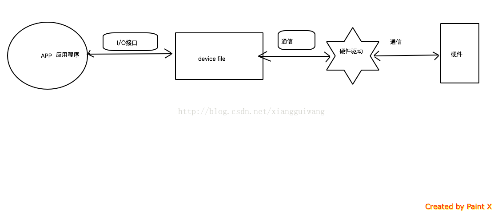

# Linux设备文件(Device file)

# 设备文件概述

在类Unix操作系统中，设备文件或特殊文件是设备驱动程序的接口，出现在文件系统中就好像它是普通文件一样。在MS-DOS，OS / 2和Microsoft Windows中也有特殊文件。 这些特殊文件允许应用程序通过标准输入/输出系统调用使用其设备驱动程序与设备进行交互。使用标准系统调用简化了许多编程任务，并且无论设备的特性和功能如何，都可以实现一致的用户空间I / O机制。

设备文件通常提供与标准设备（如打印机和串行端口）的简单接口，但也可用于访问这些设备（如磁盘分区）上的特定独特资源。此外，设备文件对于访问与任何实际设备（如数据接收器和随机数生成器）无关的系统资源非常有用。

​											图1 应用程序、块文件、驱动、硬件之间的关系

类Unix操作系统中有两种常用的设备文件，称为字符特殊文件和块特殊文件。它们之间的区别在于操作系统和硬件读取和写入的数据量。 与命名管道不同，它们可以称为设备专用文件，但命名管道并不连接到设备，但也不是普通文件。

在一些类Unix系统中，大多数设备文件作为传统上安装在/ dev的虚拟文件系统的一部分进行管理，可能与控制守护进程相关联，该守护进程在运行时监视硬件添加和删除，对设备文件系统进行相应更改，如果对设备文件系统进行更改的操作不是内核自动完成的，则控制守护进程可能调用系统或用户空间中的脚本来处理特殊设备需求。

FreeBSD和DragonFly BSD实现已经命名了虚拟设备文件系统devfs和关联的守护进程devd。 Linux主要使用称为udev的用户空间实现，但有许多变体。 Darwin以及基于它的macOS等操作系统都有纯粹的基于内核的设备文件系统。

在支持chroot进程隔离的Unix系统中，比如Solaris Containers，通常每个chroot环境都需要它自己的/ dev; 这些安装点将在全局文件系统树中各个节点上的主机操作系统上可见。通过限制将设备节点填充到/ dev的chroot实例中，硬件隔离可以由chroot环境强制实施（程序不能插入硬件，它既不能看到也不能访问名称 - 这是比Unix文件系统权限更强的访问控制形式）。

设备节点对应于操作系统内核已经分配的资源。 Unix通过一个主号码和一个次号码来标识这些资源， 都作为节点结构的一部分存储。 这些编号的分配在不同的操作系统和不同的计算机平台上独特地发生。通常，主号码标识设备驱动程序，次号码标识驱动程序控制的特定设备（可能超出许多设备）： 在这种情况下，系统可能会将次号码传递给驱动程序。 但是，在动态分配数字的情况下，情况可能并非如此（例如，在FreeBSD 5及更高版本上）。

与其他特殊文件类型一样，计算机系统使用标准系统调用访问设备节点，并将它们视为普通计算机文件。存在两种标准类型的设备文件; 不幸的是，由于历史原因，他们的名字相当反直觉，因此解释两者之间的差异通常是不正确的。

# 块文件分类

## 字符设备（Character devices）

字符特殊文件或字符设备提供无缓冲，直接访问硬件设备。 它们不一定允许程序一次读取或写入单个字符; 这取决于所讨论的设备。 例如，硬盘的字符设备通常会要求所有读写操作都对齐到块边界，并且绝对不允许读取单个字节。

字符设备有时被称为原始设备，以避免围绕一个基于块的硬件的字符设备通常需要程序读取和写入对齐的块的事实混淆。

## 块设备（Block devices）

块特殊文件或块设备提供对硬件设备的缓冲存取，并提供一些抽象的细节。 与字符设备不同，块设备将始终允许程序员读取或写入任何大小的块（包括单个字符/字节）和任何对齐。缺点是由于块设备被缓冲，编程人员不知道在写入数据从内核的缓冲区传递到实际设备之前需要多长时间，或者实际上两个单独的写入将以什么顺序到达物理设备？ 此外，如果相同的硬件暴露字符和块设备，则由于客户端使用字符设备不知道块设备的缓冲区中所做的更改而导致数据损坏的风险。

## 伪设备（Pseudo-devices）

类Unix系统上的设备节点不一定要与物理设备相对应。缺乏这种对应关系的节点形成了一组伪装置。 它们提供操作系统处理的各种功能。 一些最常用的（基于字符的）伪装置包括：

 

> / dev / null - 接受并放弃所有输入; 不产生输出（总是在读取时返回文件结束指示）
>
> / dev / zero - 接受并放弃所有输入; 产生连续的NUL（零值）字节流
>
> / dev / full - 读取时会产生连续的NUL（零值）字节流，并在写入时返回“磁盘已满”消息
>
> / dev / random和/ dev / urandom - 它们产生一个可变长度的伪随机数字流

## 节点创建

节点由mknod系统调用创建。用于创建节点的命令行程序也称为mknod。 通常的文件系统调用（重命名，取消链接）和命令（mv，rm）可以移动或删除节点。 当复制设备节点时传递选项-R或-a时，cp -l命令会创建一个与原始属性相同的新设备节点。

 

某些Unix版本包含一个名为makedev或MAKEDEV的脚本，用于在目录/ dev中创建所有必需的设备。 只有在其设备被静态分配主要编号的系统上（例如，通过在其内核模块中对其进行硬编码）才有意义。

# 块文件命名规则

以下前缀用于/ dev层次结构中某些设备的名称，以标识设备的类型：

 

> lp：行式打印机（比较lp）
>
> pt：伪终端（虚拟终端）
>
> tty：终端
>
> 一些额外的前缀已经在一些操作系统中普遍使用：
>
>  
>
> fb：帧缓冲区
>
> fd :(平台）软盘，尽管这个缩写也常用来指文件描述符
>
> 高清：（“经典”）IDE驱动程序（以前用于ATA硬盘驱动器，ATAPI光盘驱动器等）
>
> hda：第一个ATA通道上的主设备（通常由主编号3和次编号0标识）
>
> hdb：第一个ATA通道上的从属设备
>
> hdc：第二个ATA通道上的主设备
>
> hdc1：此磁盘上的第一个主分区（示例）
>
> hdc5：扩展分区中的第一个逻辑驱动器（示例）
>
> hdd：第二个ATA通道上的从属设备
>
> parport，pp：并行端口
>
> SCSI驱动程序，也被libATA（现代PATA / SATA驱动程序），USB，IEEE 1394等使用。
>
> sd：大容量存储驱动程序
>
> sda：首次注册的设备
>
> sda4：此磁盘上的最后一个分区（示例）
>
> sda6：扩展分区中的第二个逻辑驱动器（示例）
>
> sdb，sdc等：第二，第三等注册设备
>
> ses：机箱驱动程序
>
> sg：通用SCSI层
>
> sr：“ROM”驱动程序（面向数据的光盘驱动器; scd只是一个辅助别名）
>
> st：磁带驱动器
>
> tty：终端
>
> ttyS :(平台)串口驱动程序
>
> ttyUSB：USB串口转换器，调制解调器等

在Linux中使用的前缀规范列表可以在Linux设备列表中找到，Linux设备列表是Linux操作系统的分配设备编号和/ dev目录节点的正式注册表。

对于大多数设备而言，此前缀后面跟着唯一标识特定设备的编号。 对于硬盘驱动器，使用字母来标识设备，然后使用数字来标识分区。因此，文件系统可以通过/dev/sda3找到磁盘上的区域；把/dev/pts/14与联网的终端会话联系起来。